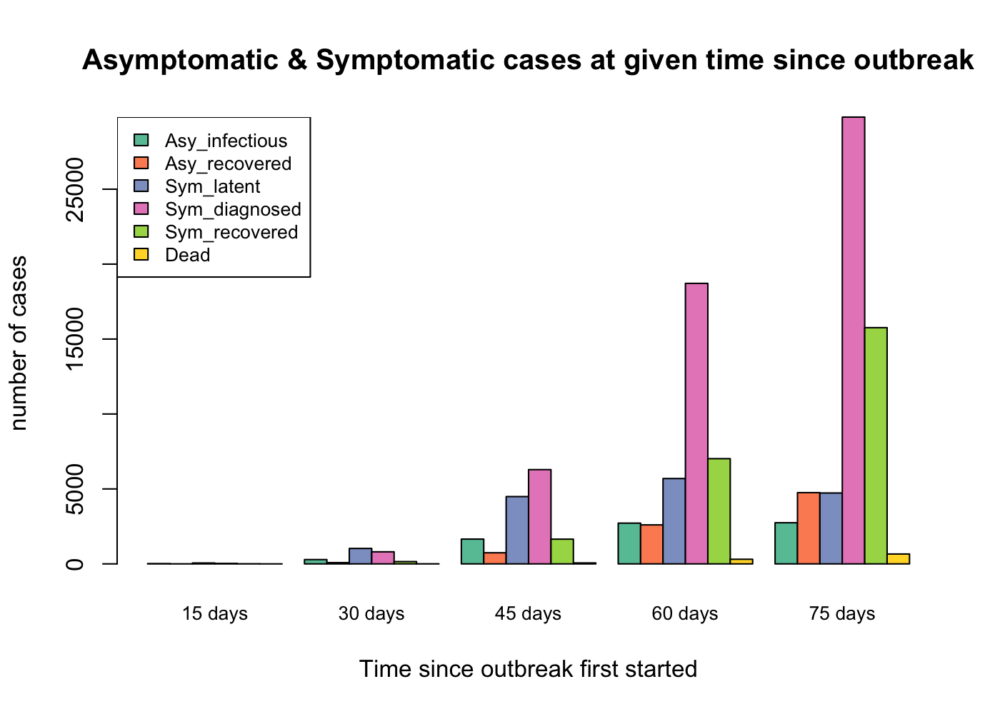
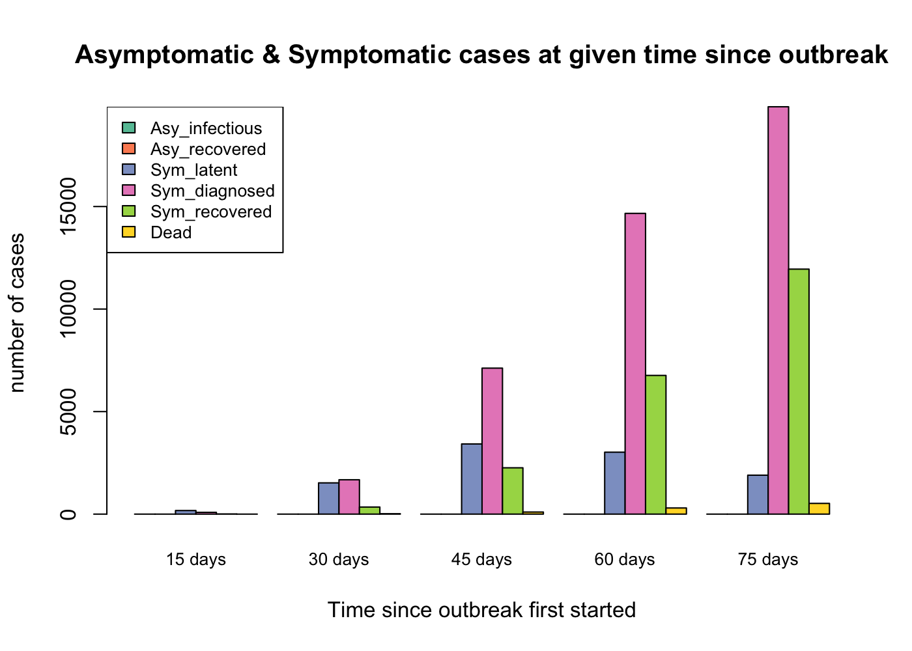
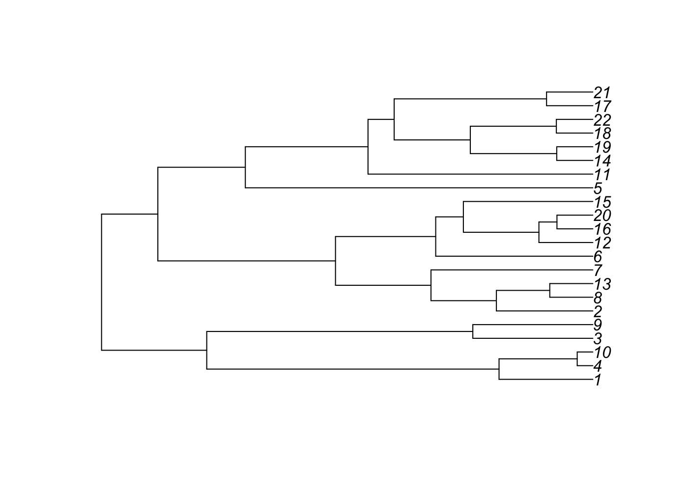
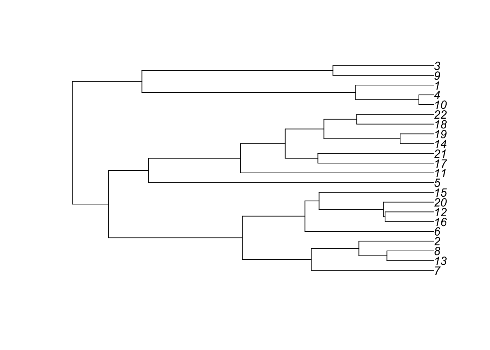
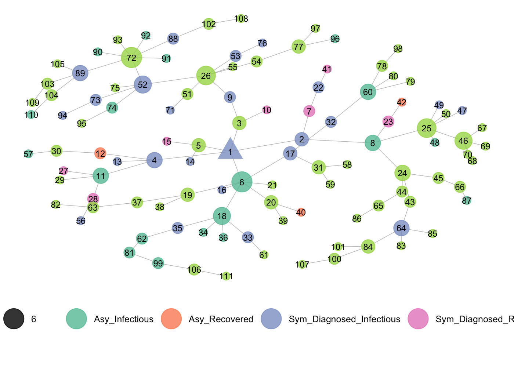
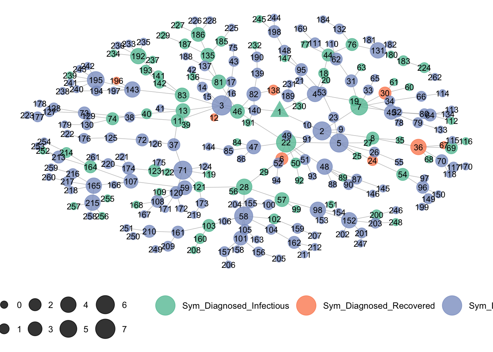

<!-- README.md is generated from README.Rmd. Please edit that file -->

# simTransmission

<!-- badges: start -->

<!-- badges: end -->

The goal of simTransmission is to provides functions to simulate,
summarize and plot transmission network and its corresponding
phylogenetic tree.

## Installation

You can install simTransmission in R using the following command:

``` r
devtools::install_github('Huimin-stat/simTransmission')
```

## Example

This is a basic example which shows you how to simulate a transmission
and plot the transmission network:

``` r
library(simTransmission)
set.seed(23)
transmission <- simTransmission(inf_rate = c(0.423,0.3), inf_rate_time = c(0,50), diag_rate = 0.143, rec_rate_asy = 0.052, rec_rate_sym = 0.0476, death_prop = 0.05, death_rate = 0.0357, inf_rate_diag = 0.02, asy_prop = 0.179, ngeneration = 8)
transmission1 <- simTransmission(inf_rate = c(0.423,0.3), inf_rate_time = c(0,50), diag_rate = 0.143, rec_rate_asy = 0.052, rec_rate_sym = 0.0476, death_prop = 0.05, death_rate = 0.0357, inf_rate_diag = 0.02, asy_prop = 0, ngeneration = 8)
times <- c(15, 30, 45, 60, 75)
cases.plot(transmatrix = transmission, times)
```



    #>                  15 days 30 days 45 days 60 days 75 days
    #> n_asy_infectious      19     286    1653    2718    2745
    #> n_asy_recoverd         3      84     741    2602    4753
    #> n_sym_latent          58    1030    4489    5694    4729
    #> n_sym_confirmed       31     804    6288   18716   29810
    #> n_sym_recovered        7     151    1649    7020   15761
    #> n_dead                 0       4      62     307     659
    cases.plot(transmatrix = transmission1, times)



    #>                  15 days 30 days 45 days 60 days 75 days
    #> n_asy_infectious       0       0       0       0       0
    #> n_asy_recoverd         0       0       0       0       0
    #> n_sym_latent         175    1524    3422    3021    1899
    #> n_sym_confirmed       87    1676    7120   14666   19865
    #> n_sym_recovered        8     345    2259    6764   11948
    #> n_dead                 0      20     102     300     523
    
    trunc <- timeTruncate(transmission1, 7)
    
    set.seed(23)
    (modeltree <- modelTreefromTransmission(trunc$truncTM))
    #> [1] "(((1:1.25152820085235,(4:0.208175600988726,10:0.208175600988726):1.04335259986363):3.90164278973893,(3:1.60171913338319,9:1.60171913338319):3.5514518572081):1.40395654848408,((((2:1.28711226020133,(8:0.574365064972786,13:0.574365064972786):0.712747195228546):0.872998901649742,7:2.16011116185107):1.27473074407551,(6:2.09693572416768,((12:0.719297439427654,(16:0.478526892437905,20:0.478526892437905):0.240770546989749):1.0084173676385,15:1.72771480706615):0.369220917101532):1.3379061817589):2.37108393602252,(5:4.6381815678628,(11:3.00062797772185,(((14:0.481451561123368,19:0.481451561123368):1.15375213741973,(18:0.486718383059806,22:0.486718383059806):1.1484853154833):1.0163764691991,(17:0.617519261662804,21:0.617519261662804):2.0340609060794):0.349047809979644):1.63755359014096):1.1677442740863):0.75120169712626):0.442872460924633;"
    (coaltree <- simCoalModeltree(1, modeltree, 0.8))
    #> [1] "((((7:2.22922899999999,((13:0.851122999999994,8:0.851122999999994):0.51083,2:1.36195299999999):0.867276):1.254702,(6:2.34453899999999,(((16:0.884468999999996,12:0.884468999999996):0.031031,20:0.915499999999996):1.171825,15:2.08732499999999):0.257214):1.139393):2.438419,(5:5.19513099999999,(11:3.520009,((17:2.108534,21:2.108534):0.59598,((14:0.610503999999991,19:0.610503999999991):1.388564,(18:1.401055,22:1.401055):0.598014):0.705445):0.815495):1.675122):0.72722):0.659632,(((10:0.269458999999996,4:0.269458999999996):1.150649,1:1.42010799999999):3.894201,(9:1.834761,3:1.834761):3.479547):1.267674);"
    plotTree(modeltree)



``` r
plotTree(coaltree)
```



``` r

trunc1 <- timeTruncate(transmission, 15)
plotTransNet(trunc1$truncTM, trunc1$index_sym_latent, trunc1$index_sym_diagnosed, trunc1$index_sym_recovered, trunc1$index_asy_infectious, trunc1$index_asy_recovered, trunc1$index_dead)
```



``` r

trunc2 <- timeTruncate(transmission1, 15)
plotTransNet(trunc2$truncTM, trunc2$index_sym_latent, trunc2$index_sym_diagnosed, trunc2$index_sym_recovered, trunc2$index_asy_infectious, trunc2$index_asy_recovered, trunc1$index_dead)
```


